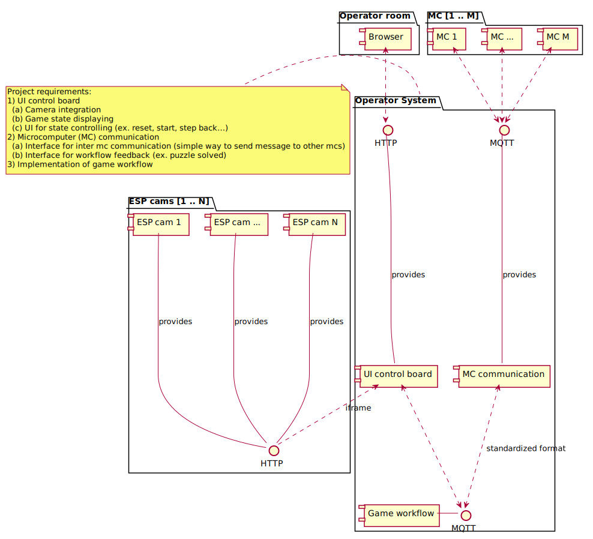
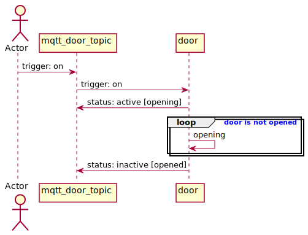

# Operator Room

## Table of content
- [Operator Room](#operator-room)
  - [Table of content](#table-of-content)
  - [What is this about?](#what-is-this-about)
  - [Components](#components)
    - [Monitoring](#monitoring)
    - [Communication](#communication)
    - [Game logic](#game-logic)
  - [General architecture](#general-architecture)
  - [Base system](#base-system)
  - [UI Control Board](#ui-control-board)
  - [MC Communication](#mc-communication)
    - [Network](#network)
    - [Message protocol](#message-protocol)
    - [Communication format](#communication-format)
    - [Communication protocol](#communication-protocol)

## What is this about?
The operator room is the control center of the escape room. It's a separate room where the operator (game master) is taking place to observe the happenings in the escape room.
The operator room supports functionality to control, monitor and trace the events of the room. It also provides mechanisms to display hints to the visitors.

Another purpose of the operator room is to centralize the communication of all involved systems. It serves as a kind of server room which provides an interface for all systems to communicate with each other. It also controls the game workflow.   
## Components
The requirements of the system can be devided into three abstract components.

### Monitoring
The monitoring serves as feedback for the operator (game master) to observe the visitors. This is for ex. camaras or microphones.

***Implementation:*** The **UI control board** is implemented as a web application. It provides following features:

  1. Camera integration
  2. Game state displaying
  3. UI for state controlling (ex. reset, start, step back…)

### Communication
The communication interface allows the participated systems to exchange messages and transit a the game states (ex. if a puzzle is solved).

***Implementation:*** The communication framework and game interface consist of two modules.

  1. Centralized and standardized interface for inter mc communication (simple way to send message to other mcs)
  2. Interface for workflow feedback and state changes (ex. puzzle solved)
   
### Game logic
The game logic is an automaton which controls the game states and their transistions.

## General architecture
The following picture shows the general architecture according to the introduced three components. The diagram consists of four packages. There is a PC with in Browser in the "Operator room" and multiple cameras ("ESP cams") and micro computers (MCs) accessing the "Operator System". The "Operator System" contains the three components.

Moreover the diagramm specifies the communication protocols between the components.



## Base system
The base system controls the deployment of software and requirements. This is done with a .deb package which contains the whole operator server. Furthermore, the package adds a script which is able to start the server and initialize settings. Currently, the script should start the following components:

- Webserver for the UI
- Main game logic
- Mosquitto message broker
- Plugin scripts of all groups

## UI Control Board
The UI Control Board is implemented by multiple .html files served by a simple python HTTP server which is listening on port 8080. The main functions of the UI consist of:

- Displaying and changing the current states of all puzzles and actors
- Displaying the camera streams
- Serving debug information about the mosquitto software
  - Possibly replaying a set of mosquitto topics

## MC Communication
### Network
All communication between the micro computers and the server will done over IP/TCP.
So every group gets an own IP range where they can use to connect their participants to the local network.

We are using the private ip range 10.0.0.0/16 (Subnet mask: 255.255.0.0).
To simplify the allocation of the ip addresses each group gets an ip range in **10.0.\<group-id\>.0/24** to use with fixed addresses. Additionally, the router acts as a DHCP server which assigns addresses from the 10.0.0.0/24 range (from 10.0.0.10).

| Group No. | Group Name                     | IP range (from - to) |
| :-------- | :----------------------------- | :------------------- |
| -         | DHCP Addresses                 | 10.0.0.10-10.0.0.254 |
| 1         | Operator Room                  | 10.0.1.0-10.0.1.254  |
| 2         | Environment & AI               | 10.0.2.0-10.0.2.254  |
| 3         | Mission Briefing               | 10.0.3.0-10.0.3.254  |
| 4         | Both Doors & First Door Puzzle | 10.0.4.0-10.0.4.254  |
| 5         | Safe & Puzzles                 | 10.0.5.0-10.0.5.254  |
| 6         | Prototype & Puzzles            | 10.0.6.0-10.0.6.254  |
| 7         | Second Door Puzzles            | 10.0.7.0-10.0.7.254  |
| 8         | AI Server & Puzzles            | 10.0.8.0-10.0.8.254  |

There are two special network members:

1. The **router** is reachable under the ip address **10.0.0.1**.
It is also the default gateway of the network.
2. The **main server** is reachable unter the ip address **10.0.0.2**.

### Message protocol
The server provides a MQTT server (more information [here](https://en.wikipedia.org/wiki/MQTT)) where all clients can publish messages to there own topics (channels) and register to topics of other clients. This allows a dynamic and centralized way to react to messages of other client without strictly defining the communication rules.

The topics of every client are clustered by group. They can be found [here](MQTTTopics.md).

### Communication format
The format of the messages exchanged between the the clients and the server is **JSON**.
JSON is a very simple and compact data format to exchange data (more information [here](https://en.wikipedia.org/wiki/JSON)). 

All messages are sended to the **main server** should JSON schema: 

```javascript
{
  "method": "<method>",
  "state": "<state>",
  "data": "<data>"
}
```

| Method  | State                    | Description                                                                                |
| :------ | :----------------------- | :----------------------------------------------------------------------------------------- |
| MESSAGE |                          | Ignored by the server. For m2m communication.                                              |
| STATUS  | inactive, active, solved | The transmitted status of the client. The \<data> of status messages is printed in the UI. |
| TRIGGER | on, off                  | Triggers a state change of an other module (ex. lamp on/off).                              |

### Communication protocol
The definition of the message protocol and the communication format is not sufficient for understanding the semantic and chronology of the messages shared between the participants. The semantic of these messages depends on the particular use case. For example the transmittion data of a finger print sensor (binary) is completely different from the data to turn on a light (boolean). The chronology of the messages is crucial to ensure the correct overall process workflow.

We'll solve these problems using UML sequence digrams
(more information [here](https://en.wikipedia.org/wiki/Sequence_diagram)).
The calls of the sequence diagram can be interprated as follows (refer to section [communication format](#communication-format)):

```
<method>: <state> [<data>]
```

[\<data>] is optional. For some use cases the trigger states "on" and "off" can be irritating. However, they are only indicators of a change of state.

For the sake of compatibility the slashes of the topic names in the sequence diagram are replaced by an underline *'\_'* and prefixed with an *'mqtt\_'*.

For example the topic name *4/door/entry* is transformed into *mqtt_4_door_entrance*.



To ensure the overall process we'll have to define the communication protocol for every group. The following table provides the communication definitions per group.

| Group No. | Group Name                     | Communication definition                                                                                                                                        |
| :-------- | :----------------------------- | :-------------------------------------------------------------------------------------------------------------------------------------------------------------- |
| 1         | Operator Room                  |                                                                                                                                                                 |
| 2         | Environment & AI               |                                                                                                                                                                 |
| 3         | Mission Briefing               |                                                                                                                                                                 |
| 4         | Both Doors & First Door Puzzle | [Doors](doc/design/group_4_door.svg), [Entrance door puzzle](doc/design/group_4_puzzle_entrance_door.svg), [Globe puzzle](doc/design/group_4_puzzle_globes.svg) |
| 5         | Safe & Puzzles                 |                                                                                                                                                                 |
| 6         | Prototype & Puzzles            |                                                                                                                                                                 |
| 7         | Second Door Puzzles            |                                                                                                                                                                 |
| 8         | AI Server & Puzzles            |                                                                                                                                                                 |


