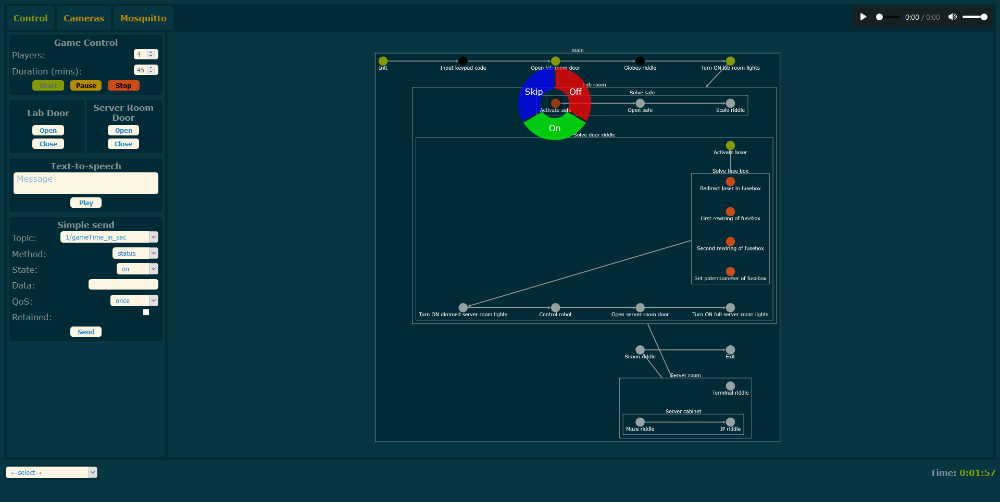
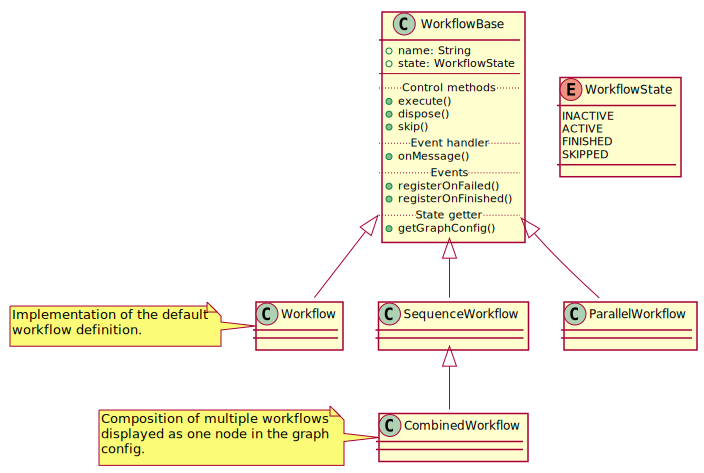
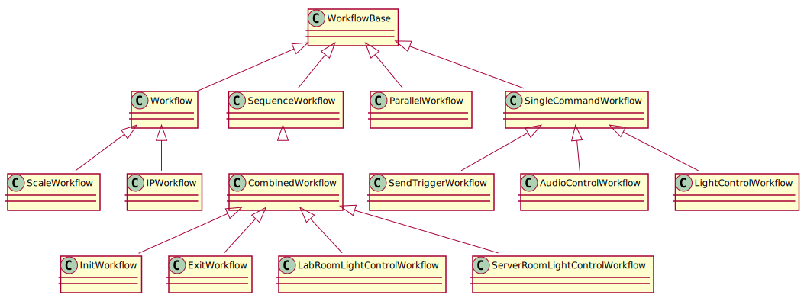

# Operator Room

## Table of content
- [Operator Room](#operator-room)
  - [Table of content](#table-of-content)
  - [What is this about?](#what-is-this-about)
  - [Components](#components)
    - [Monitoring](#monitoring)
    - [Communication](#communication)
    - [Game logic](#game-logic)
  - [General architecture](#general-architecture)
  - [Base system](#base-system)
    - [Deployment process](#deployment-process)
  - [UI Control Board](#ui-control-board)
  - [μC Communication](#μc-communication)
    - [Network](#network)
    - [Message protocol](#message-protocol)
    - [Communication format](#communication-format)
    - [Communication protocol](#communication-protocol)
      - [Default communication protocol](#default-communication-protocol)
  - [Workflow](#workflow)
    - [Software architecture](#software-architecture)
    - [Workflow definition](#workflow-definition)
    - [Starting the workflow engine](#starting-the-workflow-engine)
    - [Contolling the workflow engine](#contolling-the-workflow-engine)

## What is this about?
The operator room is the control center of the escape room. It's a separate room where the operator (game master) is taking place to observe the happenings in the escape room.
The operator room supports functionality to control, monitor and trace the events of the room. It also provides mechanisms to display hints to the visitors.

Another purpose of the operator room is to centralize the communication of all involved systems. It serves as a kind of server room which provides an interface for all systems to communicate with each other. It also controls the game workflow.

## Components
The requirements of the system can be devided into three abstract components.

### Monitoring
The monitoring serves as feedback for the operator (game master) to observe the visitors. This is for ex. a camaras or a text-to-speech system.

***Implementation:*** The **UI control board** is implemented as a web application. It provides following features:

  1. Camera integration
  2. Displaying of the states reported by the microcontrollers
  3. UI for state controlling (ex. start, stop , skip…)

### Communication
The communication interface allows the participated systems to exchange messages and transit a the game states (ex. if a puzzle is solved).

***Implementation:*** The communication framework and game interface consist of two modules.

  1. Centralized and standardized interface for inter μC communication (simple way to send message to other mcs)
  2. Interface for workflow feedback and state changes (ex. puzzle solved)
   
### Game logic
The game logic is an automaton which controls the game states and their transistions.

## General architecture
The following picture shows the general architecture according to the introduced three components. The diagram consists of four packages. There is a PC with in Browser in the "Operator room" and multiple cameras ("ESP cams") and micro computers (MCs) accessing the "Operator System". The "Operator System" contains the three components.

Moreover the diagramm specifies the communication protocols between the components.


## Base system
The base system controls the deployment of software and requirements. This is done with a .deb package which contains the whole operator server. Furthermore, the package adds a script which is able to start the server and initialize settings. Currently, the script should start the following components:

- Web server for the UI
- Main game logic
- Mosquitto message broker
- Plugin scripts of all groups
- Logging to `/var/log/mosquitto/`

### Deployment process
Requirements (for Ubuntu 18.04 LTS, others may differ):

- `build-essential`
- `hub` with either credentials or a configured token ([hub configuration](https://hub.github.com/hub.1.html#configuration), [OAuth Token](https://github.com/settings/tokens))
- `gpg` with a valid GPG key configured in `git` and in GitHub ([Configuring git](https://git-scm.com/book/en/v2/Git-Tools-Signing-Your-Work), [Add key in GitHub](https://github.com/settings/keys))

Process:

1. On dev client: `cd %REPO/packages && make VERSION=X.Y-Z`
   * The flag `make VERSION=X.Y-Z LOCAL=true` only creates the file without uploading it
2. On server:
   * first install: `wget https://github.com/ubilab-escape/operator/releases/latest/download/ue-operator.deb && sudo apt install ./ue-operator.deb`
   * update: `ue-operator update`

## UI Control Board



The UI Control Board is implemented by HTML files served by an Apache HTTP server which is listening on port 80. The main functions of the UI consist of:

- Displaying and changing the current states of all puzzles and actors (**Control**)
   * A graph displays the current state of the workflow with data sent by the logic over mqtt into the topic `1/gameState`. It also allows to skip parts and send on/off triggers to puzzles in it
   * Buttons allow to control the doors
   * A form allows to control the state of the escape room and to change settings as duration and number of players
   * Another form allows to send mqtt messages using the defind communication format by simply selecting predefined fields
   * A third form allows to control the environment over mqtt
   * The game time and state is displayed
- Displaying the camera streams (**Cameras**)
   * A fallback option is added because during the lab there were network problem sometimes. This option always connects to only one camera to decrease traffic. To use it, the server has to be started with the flag -f: `ue-operator start -f`. Then the link on the camera page leads to the fallback page.
- Serving debug information about the mosquitto software (**Mosquitto**)
   * This provides the possibility to subscribe to different group's mqtt topic and to the log topic.
   * A basic form to send mqtt messages is also added
   * This page furthermore contains helpful information about the message format and the defined topics (accessable over the small ? and ! buttons)
  
It's making use of several open-source JavaScript libraries:

- Eclipse Paho JavaScript Client ([Documentation](https://www.eclipse.org/paho/files/jsdoc/index.html), [Eclipse Public License](https://www.eclipse.org/legal/epl-v10.html))
- cytoscape ([Documentation](https://js.cytoscape.org/), [MIT License](https://github.com/cytoscape/cytoscape.js/blob/master/LICENSE))
- cytoscape-cxtmenu ([Documentation](https://github.com/cytoscape/cytoscape.js-cxtmenu), [MIT License](https://github.com/cytoscape/cytoscape.js-cxtmenu/blob/master/LICENSE))
- cytoscape-dagre ([Documentation](https://github.com/cytoscape/cytoscape.js-dagre), [MIT License](https://github.com/cytoscape/cytoscape.js-dagre/blob/master/LICENSE))
- dagre ([Documentation](https://github.com/dagrejs/dagre), [MIT License](https://github.com/dagrejs/dagre/blob/master/LICENSE))
- markdown-it ([Documentation](https://github.com/markdown-it/markdown-it), [MIT License](https://github.com/markdown-it/markdown-it/blob/master/LICENSE))

For providing offline capabilities, these libraries are saved in the subfolder `libs`

## μC Communication
### Network
All communication between the micro computers and the server will done over MQTT (IP/TCP).
So every group gets an own IP range where they can use to connect their participants to the local network.

We are using the private ip range 10.0.0.0/16 (Subnet mask: 255.255.0.0).
To simplify the allocation of the ip addresses each group gets an ip range in **10.0.\<group-id\>.0/24** to use with fixed addresses. Additionally, the router acts as a DHCP server which assigns addresses from the 10.0.0.0/24 range (from 10.0.0.10).

| Group No. | Group Name                     | IP range (from - to) |
| :-------- | :----------------------------- | :------------------- |
| -         | DHCP Addresses                 | 10.0.0.10-10.0.0.254 |
| 1         | Operator Room                  | 10.0.1.0-10.0.1.254  |
| 2         | Environment & AI               | 10.0.2.0-10.0.2.254  |
| 3         | Mission Briefing               | 10.0.3.0-10.0.3.254  |
| 4         | Both Doors & First Door Puzzle | 10.0.4.0-10.0.4.254  |
| 5         | Safe & Puzzles                 | 10.0.5.0-10.0.5.254  |
| 6         | Prototype & Puzzles            | 10.0.6.0-10.0.6.254  |
| 7         | Second Door Puzzles            | 10.0.7.0-10.0.7.254  |
| 8         | AI Server & Puzzles            | 10.0.8.0-10.0.8.254  |

There are two special network members:

1. The **router** is reachable under the ip address **10.0.0.1**.
It is also the default gateway of the network.
2. The **main server** is reachable unter the ip address **10.0.0.2**.

### Message protocol
The server provides a MQTT server (more information [here](https://en.wikipedia.org/wiki/MQTT)) where all clients can publish messages to there own topics (channels) and register to topics of other clients. This allows a dynamic and centralized way to react to messages of other client without strictly defining the communication rules.

The topics of every client are clustered by group. They can be found [here](MQTTTopics.md).

### Communication format
The format of the messages exchanged between the the clients and the server is **JSON**.
JSON is a very simple and compact data format to exchange data (more information [here](https://en.wikipedia.org/wiki/JSON)). 

All messages are sended to the **main server** should match following JSON schema: 

```json
{
  "method": "<method>",
  "state": "<state>",
  "data": "<data>"
}
```

| Method  | State                            | Description                                                                                                                                                                         |
| :------ | :------------------------------- | :---------------------------------------------------------------------------------------------------------------------------------------------------------------------------------- |
| message |                                  | Ignored by the server. For m2m communication.                                                                                                                                       |
| status  | inactive, active, solved, failed | The transmitted status of the client. The \<data> of status messages is printed in the UI.  All messages using this method **must** set the **retained** flag if the MQTT protocol! |
| trigger | on, off                          | Triggers a state change of an other module (ex. lamp on/off).                                                                                                                       |

### Communication protocol
The definition of the message protocol and the communication format is not sufficient for understanding the semantic and chronology of the messages shared between the participants. The semantic of these messages depends on the particular use case. For example the transmittion data of a finger print sensor (binary) is completely different from the data to turn on a light (boolean). The chronology of the messages is crucial to ensure the correct overall workflow.

We'll solve these problems using UML sequence digrams
(more information [here](https://en.wikipedia.org/wiki/Sequence_diagram)).
The calls of the sequence diagram can be interprated as follows (refer to section [communication format](#communication-format)):

```
<method>: <state> [<data>]
```

[\<data>] is optional. For some use cases the trigger states "on" and "off" can be irritating. However, they are only indicators of a change of state.

For the sake of compatibility the slashes of the topic names in the sequence diagram are replaced by an underline *'\_'* and prefixed with an *'mqtt\_'*.

For example the topic name *4/door/entrance* is transformed into *mqtt_4_door_entrance*. Please do not use this modified names as MQTT topics!


#### Default communication protocol
To ensure the overall process we'll have to define the communication protocol. 
Because most of the groups have simliar communication protocols, we have defined a default sequence diagram:


If there are different use cases for some groups we're defining customized communication protocols.
The following table provides the customized communication definitions:

| Group No. | Group Name                     | Communication definition                                                                                                                                        |
| :-------- | :----------------------------- | :-------------------------------------------------------------------------------------------------------------------------------------------------------------- |
| 1         | Operator Room                  |                                                                                                                                                                 |
| 2         | Environment & AI               |                                                                                                                                                                 |
| 3         | Mission Briefing               |                                                                                                                                                                 |
| 4         | Both Doors & First Door Puzzle | [Doors](doc/design/group_4_door.svg), [Entrance door puzzle](doc/design/group_4_puzzle_entrance_door.svg), [Globe puzzle](doc/design/group_4_puzzle_globes.svg) |
| 5         | Safe & Puzzles                 |                                                                                                                                                                 |
| 6         | Prototype & Puzzles            |                                                                                                                                                                 |
| 7         | Second Door Puzzles            |                                                                                                                                                                 |
| 8         | AI Server & Puzzles            |                                                                                                                                                                 |

## Workflow
### Software architecture
The game logic is implemented via a custom workflow engine.
It's a simple and self-written workflow framework developed in python.

There are three main components of the workflow engine, which allows to build arbitrary workflows:

1. **Workflow**: This workflow implements the default procedure defined in section "[Default communication protocol](#default-communication-protocol)".

2. **SequenceWorkflow**: This workflow is a *composition* of other workflows which should be executed in sequence (one after another).

3. **ParallelWorkflow**: This workflow is a *composition* of other workflows which should be executed in parallel.

The composition workflows allows to slot workflows together and building more complex workflows. The following class diagram illustrates the base workflow dependencies.



To implement special workflows the model allows to simply inherit from the main components. In our case we had to implement so custom workflow definitions due to some technical issues or to simplify routines.



### Workflow definition
The definition of main workflow takes place in a python file ([our escape room workflow](logic/workflow_definition.py)).

The only requirement to this python file is to contain a method with following signature returning an array of **BaseWorkflow**s.

```python
def create(self, settings)
```

The returned array itself is interpreted as a **SequenceWorkflow**.

The following example shows a simple workflow which executes *Puzzle 1*.
After *Puzzle 1* is finished, *Puzzle 2* and *Puzzle 4* are executed in parallel.
After *Puzzle 2* and *Puzzle 4* is executed, the workflow reaches it's final state. 

```python
from workflow import *
from message import State

class WorkflowDefinition:

    def create(self, settings):
        return [
            Workflow("Puzzle 1", "<topic_name_puzzle_1>"),
            ParallelWorkflow("Parallel block", [
                SequenceWorkflow("Sequence block", [
                  Workflow("Puzzle 2", "<topic_name_puzzle_2>"),
                  Workflow("Puzzle 3", "<topic_name_puzzle_3>"),
                ]),
                Workflow("Puzzle 4", "<topic_name_puzzle_4>"),
            ])
        ]
```

### Starting the workflow engine
The workflow engine can be executed by following command:

```console
foo@bar:~$ python3 logic/main.py -h
usage: main.py [-h] [--workflow_def WORKFLOW_DEF] [--mqtt_host MQTT_HOST]

optional arguments:
  -h, --help            show this help message and exit
  --workflow_def WORKFLOW_DEF, -d WORKFLOW_DEF
                        definition of the workflow. Format: "module:class".
                        The referenced class must implement a method
                        "create(self, settings)" returning an array of
                        BaseWorkflow. (default:
                        workflow_definition:WorkflowDefinition)
  --mqtt_host MQTT_HOST, -m MQTT_HOST
                        IP of the MQTT server. (default: 127.0.0.1)
```

### Contolling the workflow engine
There are two ways to control the workflow engine on runtime:

1. Sending commands to topic "1/gameControl":
   1. **START**: Starts or resume the workflow.
   2. **PAUSE**: Pauses the workflow (simply pauses game timer).
   3. **STOP**: Stops the workflow and resets it's states.
   4. **SKIP** \<workflow_name>: Skips the workflow with the given \<workflow_name>.

2. Applying options in topic "1/gameOptions" before starting the workflow.
   
   Defined JSON schema of the options:
   ```javascript
   {
     "participants": 3, // number of players
     "duration": 5 // in seconds
    }
   ```

   The options are not applyed if the game is already started.
